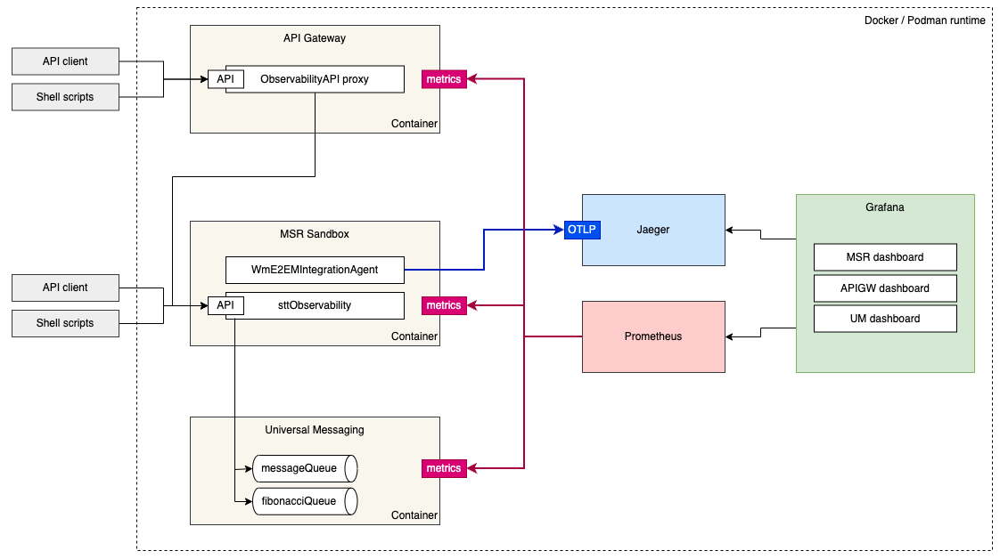
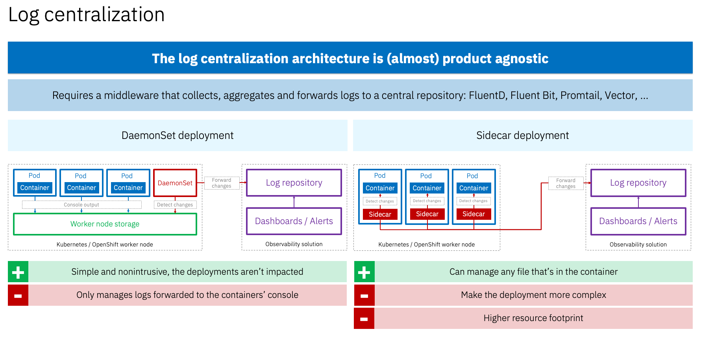

# webMethods observability

This repository contains various assets to showcase observability within the webMethods ecosystem:
-   a MSR integration package which exposes various API endpoints, grouped into a REST Observability API
-   a docker compose stack
-   a webMethods API GW proxy zip for the REST observability API
-   scripts to automate the invocation of the API
-   Grafana dashboards to observe the metrics exposed by the MSR, API GW and UM

##  Prerequisites

You must be logged onto the IBM cp.icr.io container registry. This is explained in the product documentation, see for instance https://docs.webmethods.io/on-premises/webmethods-api-gateway/en/11.1.0/webhelp/index.html#page/yai-webhelp%2Fta-install_apigw_docker_11.x.html  

The docker compose stack includes a sandbox MSR which uses the End-to-end monitoring agent package. This package isn't part of this Github repo, you need to fetch it from  https://packages.webmethods.io. Normally you'd use wpm to install this package, but I chose instead to download a copy of the package and mount it as a volume into my MSR container. The docker compose stack expects it in $HOME/git/WmE2EMIntegrationAgent, but you can change the location to your liking.

##  Architecture

At this stage, we only cover Prometheus metrics (MSR, UM, API Gateway) and Open Telemetry traces (MSR.) At target there will also be traces for the API Gateway.  



As far as logs are concerned, this is also not covered for the time being. The following slide provides some explanations. 



##  Installation

cd into the ./resources/compose directory where you'll find the docker compose stack. Instead of putting everything into one single docker-compose.yml file I have gone for a more modular approach, each container has its own subfolder.  

Tu run the stack, execute 
```
./up.sh
```
  
To stop it execute
```
./down.sh
```
  
To choose which containers you want to run comment out or out lines in setenv.sh  

I only provide posix shell scripts, if you're on Windows you can either work in WSL or convert these simple script into bat or powershell ones.  
Note that I am using "podman compose", if you're using "docker compose" (or the "docker-compose" variant), the scripts update is straightforward.  

The stack contains:
-   a Microservices Runtime sandbox, into which we mount the sttObservability package (which is at the root of this Github repo) and the WmE2EMIntegrationAgent package. We also inject an application.properties file which amongst other things configures the UM connection and activates auditing for some flow services (this is required in order to emit OTEL spans.)
-   a Universal Messaging realm. Note that connection factory and JMS destinations are created automatically there, using the jms.DEFAULT_IS_JMS_CONNECTION.jndi_automaticallyCreateUMAdminObjects=true property in the MSR application.properties file
-   an API Gateway as well at an Elastic datastore and a Kibana instance.
-   a Prometheus instance, which is preconfigured to scrape the MSR, API gateway and UM metrics. I have deliberately chosen not to configure persistence for this Prometheus.
-   a Grafana instance, which is preconfigured with a connection to the Prometheus instance and with three dashboards: MSR, API GW and UM.
-   a Jaeger instance, which receives the Open Telemetry spans emitted by the MSR. At target I also plan to have API Gateway spans to have a real end-to-end view there.
  

| Component               | URL                          | 
|-------------------------|----------------------------|
| MSR admin console      | [http://localhost:15555](http://localhost:15555) | 
| API Gateway UI         | [http://localhost:9072](http://localhost:9072)   | 
| API Gateway service    | [http://localhost:45555](http://localhost:45555) |
| Prometheus             | [http://localhost:9090](http://localhost:9090)   | 
| Grafana               | [http://localhost:3000](http://localhost:3000)   | 
| Jaeger                | [http://localhost:16686](http://localhost:16686) |
  
UM and Elastic ports aren't mapped, if you need to access them then just modify their docker-compose.yml.  
Use the default product user names and passwords to connect (login is disabled for Prometheus, Grafana and Jaeger.)   
I have chosen simplicity over security here, assuming this stack runs on a laptop. If you want to host all this on a remote server, please do harden the security settings!!!  

##  Post installation

The import of the [Observability API proxy](./resources/api/ObservabilityAPI.zip) into the API Gateway isn't automated yet. You can either do it in the Gateway UI or via an API call to POST /rest/apigateway/archive  
The proxy archive embeds an application with an API key that you can use to call the API.  

##  Observability demo

A few scripts are available under ./resources/scripts to call the Observability API. They're documented in [this README](./resources/scripts/README.md), while the API specification is [available here](./resources/api/ObservabilityAPI.yml).

